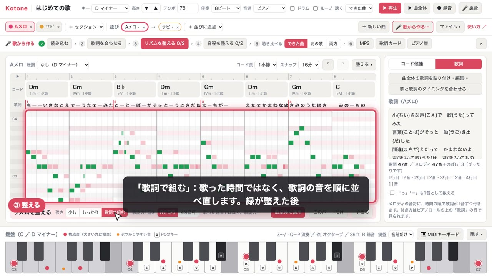

# Kotone

コード進行・メロディ・歌詞をひとつの画面で作れる、J-POP向けの作曲ツールです（Kotone ＝ 言＋音）。

**Web 版：https://kotonemusic.pages.dev** ／ 使い方：https://kotonemusic.pages.dev/manual

- コードを選ぶと、J-POPの定番の流れから次のコードを提案（王道進行・小室進行などの続きも検出）
- ピアノロールでメロディを作り、歌詞レーンで音符と歌詞の結びつきを見ながら作曲
- 1曲分の歌詞を貼り付けて、Aメロ・Bメロ・サビに割り当て（1番・2番も扱える）
- ピアノ／ギター音源で再生、MIDI書き出し（コード・ベース・メロディ・ドラム・歌詞）

## 紹介動画

### 歌って作る（3分24秒）

[](https://kotonemusic.pages.dev/sing.mp4)

▶ [動画を見る（ブラウザで再生）](https://kotonemusic.pages.dev/sing.mp4) ― 歌詞を入れる → 録音して歌う → メロディとコードができる → 元の歌と聴き比べる → 「歌詞で組む」で拍を整える → 外した音を直す → 通して再生 → MP3・歌詞カード・ピアノ譜の書き出し まで。楽器も楽譜も使いません。歌声は、歌詞を見ながら思いついた節で自由に歌った録音です。

### コードを選んで、鍵盤で作る（2分56秒）

[](https://kotonemusic.pages.dev/intro.mp4)

▶ [動画を見る（ブラウザで再生）](https://kotonemusic.pages.dev/intro.mp4) ― 歌詞の貼り付け → コード選び → メロディの録音 → 通して再生 → MIDI書き出し まで、実際に操作して1曲作っています（字幕とアプリの音のみ）。

## 使い方

`index.html` をブラウザで開くだけで動きます（サーバーは不要）。ピアノ・ギターの音源は初回にインターネットから読み込みます。

詳しい操作は `manual.html` を見てください。

## Web 版へのデプロイ

Cloudflare Pages（プロジェクト名 `kotonemusic`）で公開しています。`npx wrangler login` 済みの状態で、次を実行するとアプリ・マニュアル・紹介動画だけがデプロイされます。

```sh
./deploy.sh
```

## 紹介動画の作り直し

`video/make-video.mjs` が、Chrome（インストール済みのもの）を自動操作して Web 版で1曲を作り、その様子を録画して MP4 にします（ffmpeg が必要）。

```sh
cd video
npm install
node make-video.mjs        # コードを選んで鍵盤で作る → video/out/kotone-intro.mp4（約3分で完成）
node make-video-sing.mjs   # 歌って作る → video/out-sing/kotone-sing.mp4（約4分で完成）
```

「歌って作る」の動画の歌詞は `video/sing-song.mjs` にあります。歌声は、`songs/video/my-voice.m4a`（人が歌った録音。Git の管理外）があればそれを使い、なければ同じファイルにある合成の声を使います。どちらも、マイクの代わりに Chrome へ流しています。

字幕の文言、歌詞、メロディ、待ち時間はスクリプトの中で変えられます。音は録画中に鳴らした音の記録から、録画後にオフラインで作り直しています（録画中の処理の重さで音が乱れないように）。
