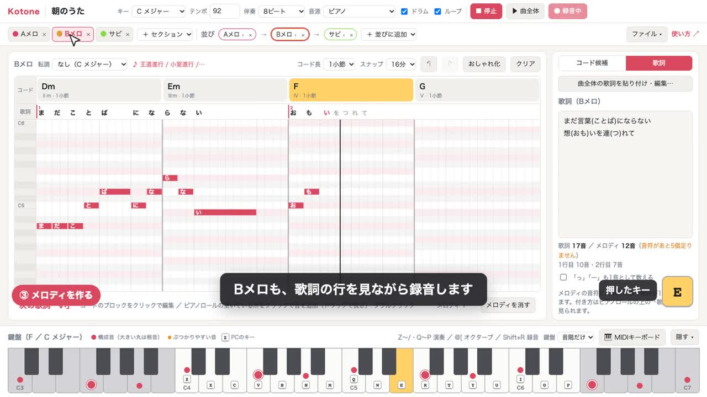

# Kotone

コード進行・メロディ・歌詞をひとつの画面で作れる、J-POP向けの作曲ツールです（Kotone ＝ 言＋音）。

**Web 版：https://kotonemusic.pages.dev** ／ 使い方：https://kotonemusic.pages.dev/manual

## 紹介動画（2分50秒）

[](media/kotone-intro.mp4)

▶ [紹介動画を見る](media/kotone-intro.mp4) ― 歌詞の貼り付け → コード選び → メロディの録音 → 通して再生 → MIDI書き出し まで、実際に操作して1曲作っています（字幕とアプリの音のみ）。

- コードを選ぶと、J-POPの定番の流れから次のコードを提案（王道進行・小室進行などの続きも検出）
- ピアノロールでメロディを作り、歌詞レーンで音符と歌詞の結びつきを見ながら作曲
- 1曲分の歌詞を貼り付けて、Aメロ・Bメロ・サビに割り当て（1番・2番も扱える）
- ピアノ／ギター音源で再生、MIDI書き出し（コード・ベース・メロディ・ドラム・歌詞）

## 使い方

`index.html` をブラウザで開くだけで動きます（サーバーは不要）。ピアノ・ギターの音源は初回にインターネットから読み込みます。

詳しい操作は `manual.html` を見てください。

## Web 版へのデプロイ

Cloudflare Pages（プロジェクト名 `kotonemusic`）で公開しています。`npx wrangler login` 済みの状態で、次を実行するとアプリとマニュアルだけがデプロイされます。

```sh
./deploy.sh
```

## 紹介動画の作り直し

`video/make-video.mjs` が、Chrome（インストール済みのもの）を自動操作して Web 版で1曲を作り、その様子を録画して MP4 にします（ffmpeg が必要）。

```sh
cd video
npm install
node make-video.mjs   # → video/out/kotone-intro.mp4（約3分で完成）
```

字幕の文言、歌詞、メロディ、待ち時間はスクリプトの中で変えられます。音は録画中に鳴らした音の記録から、録画後にオフラインで作り直しています（録画中の処理の重さで音が乱れないように）。
